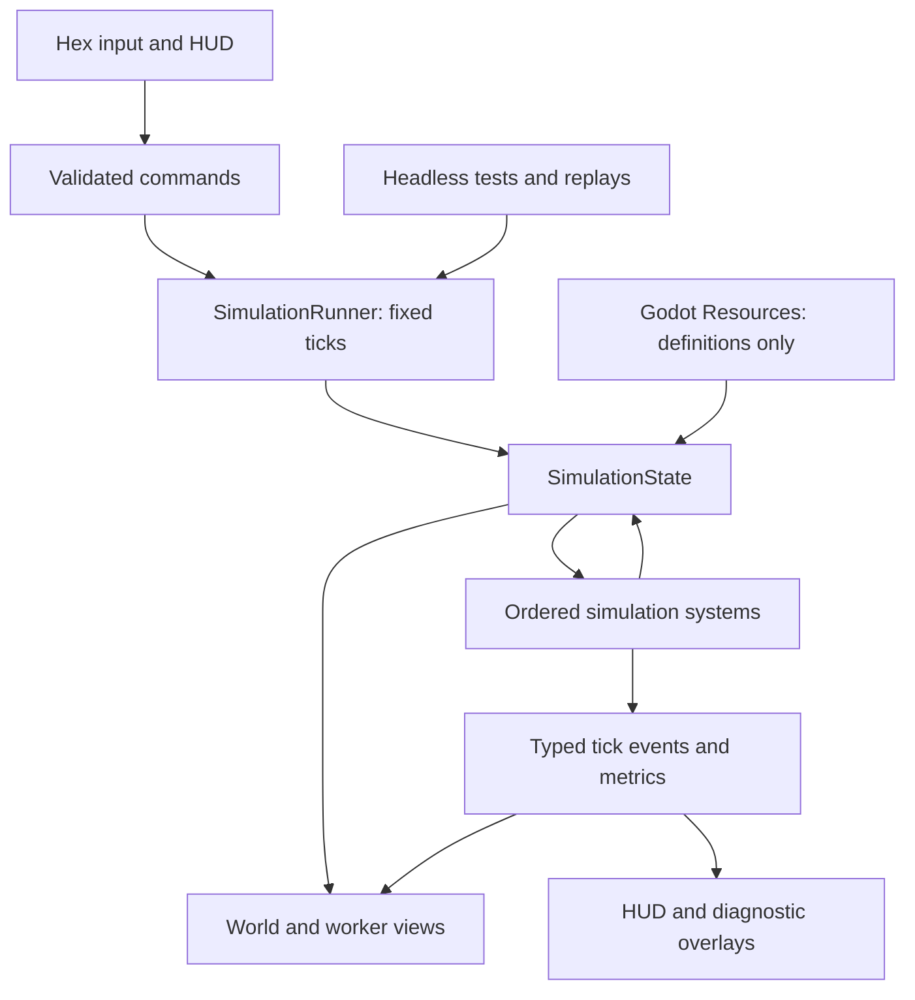

# Steampunk Logistics Prototype — Design Specification

**Status:** Approved for implementation planning  
**Date:** 2026-07-10  
**Engine:** Godot 4.6.2, GDScript  
**Working repository:** `https://github.com/igolebe7-lab/steampunk.git`

## 1. Product intent

The long-term game is a colonial-industrial steampunk automation game on a hex grid. Its central fantasy is not simply building a factory; it is guiding a society through an industrial transition. People, animals, roads, vehicles, steam machines, and local conveyors coexist instead of each new logistics tier immediately replacing the previous one.

The design pillars to preserve are:

1. Physical logistics: workers and later vehicles visibly carry goods.
2. Industrial transition: manual work gradually becomes mechanized.
3. Technology trades one constraint for another instead of removing play.
4. Steam is eventually a physical pressure network, not abstract electricity.
5. The primary pressure comes from an increasingly complex system rather than mandatory combat.

The full concept is intentionally larger than the first implementation cycle. The first prototype tests only the highest-risk and most distinctive hypothesis.

## 2. Prototype hypothesis and success condition

**Hypothesis:** observing, diagnosing, and improving a physical flow of workers and cargo is enjoyable before advanced automation exists.

The prototype is a 15–20 minute scenario on a hand-authored 18×18 hex map. The player starts with an inefficient logistics network and six autonomous porters. The objective is to deliver the resources needed to activate a boiler and produce the first strike of a steam hammer.

The prototype succeeds when a player can:

- finish the scenario in roughly 15–20 minutes;
- identify the first bottleneck without developer explanation;
- understand the diagnostic reason for a delay;
- increase throughput by at least 25% through roads, one relay depot, or priorities;
- perceive a clear difference between open ground, paths, and dirt roads;
- understand that the steam hammer is the result of reorganizing logistics.

## 3. Player experience and scenario flow

### 0–3 minutes: observe

The camp, main warehouse, four resource sources, and six porters already exist. Sources create cargo at a fixed rate. Porters autonomously accept delivery jobs and move across open ground. The player can inspect workers, jobs, routes, and inventories.

### 3–7 minutes: encounter the first bottleneck

Wood and iron deliveries share an inefficient choke point. Delivery queues grow, workers wait for occupied cells, and average delivery time rises. The interface exposes these symptoms without prescribing a single solution.

### 7–11 minutes: improve the flow

The player can build or upgrade a route, place one relay warehouse, and change delivery priorities. The system reports the resulting improvement in cargo per minute and time spent moving versus waiting.

### 11–16 minutes: accept a new load

The steam-hammer construction site activates. It requests wood, iron, coal, and water barrels at the same time. The newly expanded demand stresses the network again.

### 16–20 minutes: reorganize and finish

The player performs a second improvement. Once all required cargo reaches the site, the boiler activates and the steam hammer makes its first strike. A results panel compares throughput and delay statistics from before and after the player's changes.

There is no hard loss state. A stalled network remains recoverable through rebuilding, reprioritization, or warehouse placement.

## 4. Prototype scope

### Included

- flat top-down 2D presentation;
- axial-coordinate hex grid;
- one hand-authored 18×18 scenario;
- six physical porter agents;
- delivery jobs, automatic assignment, pathfinding, cell reservation, loading, and unloading;
- wood, iron, coal, and water cargo;
- open ground, path, and dirt-road movement costs;
- camp, source sites, main warehouse, one relay warehouse, boiler, and steam hammer;
- build road, place warehouse, set priority, and inspect actions;
- pause and ×1, ×2, and ×4 simulation speeds;
- diagnostic overlays and per-worker inspection;
- scenario metrics and results screen;
- minimal construction, pickup, drop-off, steam, and hammer-impact sound effects.

### Simplified

- sources generate cargo without simulated extractors;
- every porter carries one standardized cargo unit;
- there is only one worker profession;
- steam is a binary supplied/not-supplied condition;
- traffic uses deterministic cell reservation rather than full local collision avoidance;
- cargo is represented by type and quantity rather than a separate world entity while stored;
- only one scenario and one goal exist.

### Explicitly excluded

- worker needs, fatigue, housing, loyalty, health, and wages;
- animals, carts, tractors, rails, conveyors, and automatons;
- physical pressure, pipes, leaks, heat, and boiler explosions;
- technology trees, research, and multiple eras;
- weather, disasters, combat, and hostile creatures;
- procedural map generation;
- save/load, localization, tutorial campaign, and accessibility settings beyond basic scalable UI;
- final art, music, and production balancing.

## 5. Architecture decision

The prototype uses a **data-first, deterministic fixed-tick simulation** separated from Godot presentation nodes. The simulation is the only source of gameplay truth. Rendering reads simulation snapshots and events but does not own inventories, jobs, movement decisions, or scenario progress.



The default simulation rate is 10 ticks per second. Rendering targets 60 frames per second and interpolates worker positions between completed ticks. The exact tick rate remains configurable for testing, but gameplay logic never depends directly on render-frame delta.

The data flow is one-way:

`input → command → simulation tick → state/events → presentation`

## 6. Runtime model

`SimulationState` is the single mutable snapshot of the world. It contains:

- map bounds and hex-cell data;
- workers and their current state;
- buildings and local inventories;
- delivery jobs and assignments;
- paths and cell reservations;
- simulation clock, scenario state, and metrics;
- deterministic random seed when randomness is introduced.

Core runtime types have stable integer identifiers. References between runtime entities use identifiers rather than Godot node paths.

Key model types:

- `HexCoord`: axial `q/r` coordinate value object;
- `HexCellState`: terrain, road tier, occupant, and reservation data;
- `WorkerState`: position, movement progress, carried cargo, job, route, and wait reason;
- `BuildingState`: definition identifier, position, inventory, requests, and priority;
- `DeliveryJob`: source, destination, cargo type, lifecycle state, priority, and assignee;
- `ScenarioState`: current phase, objective quantities, completion state, and measurements.

Godot `Resource` assets define immutable authoring data:

- `ResourceDef`: identifier, display name, color, and icon;
- `RoadDef`: build cost, traversal cost, and display properties;
- `BuildingDef`: footprint, cost, inventory rules, request rules, and view scene;
- `ScenarioDef`: map, starting entities, limits, objective, and measurement windows.

Runtime inventories and mutable state never live in shared definition resources.

## 7. Simulation order

Every tick applies systems in a stable order:

1. `CommandSystem` validates and applies queued player actions.
2. `JobSystem` converts inventory needs and available cargo into delivery jobs.
3. `AssignmentSystem` assigns suitable jobs to idle workers.
4. `PathSystem` creates or repairs worker routes.
5. `MovementSystem` reserves cells and advances workers.
6. `InventorySystem` performs pickup and drop-off operations.
7. `ScenarioSystem` updates objective progress and completion.
8. `TelemetrySystem` records throughput, travel time, waiting time, and bottlenecks.
9. `InvariantChecker` runs in debug and test builds.

Systems do not use Godot scene nodes to communicate. They receive the state and explicit dependencies, then return events or result values. Events are emitted after state mutation so presentation never observes a half-applied tick.

## 8. Godot integration boundaries

Godot scenes and nodes are adapters around the simulation:

- `GameApp` is the only initial autoload and owns high-level scenario startup;
- `SimulationRunner` owns tick scheduling, pause, and time scale;
- `WorldView` renders the map and synchronizes building views;
- `WorkerView` interpolates a single worker's position and displays its cargo marker;
- `HUDController` converts UI actions into commands;
- `DiagnosticsView` displays routes, utilization, queues, and wait reasons;
- `CameraController` handles pan, zoom, and map bounds.

Signals are used at presentation boundaries for coarse events such as scenario completion, selection change, and snapshot availability. A global event bus is not used in the prototype. GDScript is statically typed wherever Godot permits it, and autoloads remain limited to genuinely global application lifecycle concerns.

## 9. Interface design

The map remains the dominant surface. Panels occupy the screen edges and do not cover the logistics network.

### Top bar

- current quantities of wood, iron, coal, and water;
- steam-hammer objective progress;
- pause and ×1/×2/×4 controls.

### Left diagnostics panel

Toggleable overlays for:

- worker routes;
- road utilization and choke points;
- inventories;
- job queue and unassigned demand.

### Right inspector

For a selected worker, display:

- current job and cargo;
- source and destination;
- route length and estimated arrival time;
- time spent moving and waiting;
- a human-readable wait reason.

For buildings, the same area displays inventory, incoming requests, priority, and blocked reasons.

### Bottom action bar

Only four actions are exposed:

- build/upgrade road;
- place the single relay warehouse;
- change priority;
- inspect.

No minimap, large construction catalog, technology screen, or multi-page management UI is included.

## 10. Errors, recovery, and observability

Player commands return structured failure reasons such as out of bounds, occupied cell, insufficient resources, invalid footprint, or missing road connection. The UI translates these codes into concise messages.

Every job has an explicit lifecycle and wait reason. Supported reasons include no worker, no cargo, destination full, no route, and temporary cell reservation. A worker whose route becomes invalid releases reservations, returns the job to the queue, and requests replanning. Workers must never remain silently stuck.

Debug and test builds validate these invariants after ticks:

- no inventory quantity is negative;
- one job cannot be assigned to multiple workers;
- one cell cannot be reserved incompatibly by multiple workers;
- pickup and drop-off conserve cargo;
- paths remain within map bounds;
- identifiers reference existing runtime entities.

The simulation retains a bounded recent event log and the initial seed. A failing scenario can therefore be reproduced headlessly using the same starting state and command trace.

Invalid resource or scenario definitions fail fast during loading with a precise error. The game does not attempt to run a partially valid world.

## 11. Asset workflow

### Functional graybox

The first implementation uses scalable vector shapes, flat colors, labels, and simple effects. Visual language is diagnostic:

- wood: green;
- iron: blue-gray;
- coal: near-black;
- water: blue;
- normal flow: neutral;
- waiting: amber;
- blocked: red.

Workers are circles with direction and cargo markers. Roads differ by width, value, and edge treatment. Buildings use distinct silhouettes and short labels. These assets are intentionally readable at multiple zoom levels.

### First art pass

An art pass begins only after the mechanical playtest succeeds:

1. approve a compact visual style guide;
2. approve one reference worker, warehouse, road, and steam hammer;
3. generate or draw coherent batches;
4. normalize palette, scale, shadows, and anchors;
5. replace presentation assets without changing simulation state or systems.

The intended direction is warm, material steampunk: brass, cast iron, wood, brick, wet earth, canvas, smoke, and steam. It is not dark dieselpunk and should not look exactly like nineteenth-century Earth.

Editable source assets and game-ready assets remain separate. Godot-generated `.godot/` data, local brainstorming files, logs, and exports are ignored by Git.

## 12. Testing strategy

### Unit tests

Headless tests cover:

- hex neighbors, distance, conversion, and path cost;
- job creation and assignment;
- pathfinding and replanning;
- reservations and deterministic conflict resolution;
- pickup, drop-off, and cargo conservation;
- command validation;
- deterministic results for identical inputs.

### Scenario tests

Small fixed scenarios validate:

- source-to-warehouse delivery;
- route invalidation and recovery;
- full-destination blocking with the correct reason;
- measurable improvement after road construction;
- relay-warehouse behavior;
- completion after all steam-hammer cargo arrives.

### Godot integration tests

Godot 4.6.2 headless runs verify:

- resource import;
- GDScript parsing;
- main-scene startup;
- presentation entity creation and removal;
- pause and time-scale controls;
- scenario completion signaling.

### Playtest and visual checks

The scenario is played through in the Godot editor. Screenshots verify HUD legibility and overlay behavior. Metrics and observations are recorded against the success conditions in Section 2.

### Stress test

A non-player 40×40 scenario with 50 workers runs at 10 ticks per second. It detects architectural regressions beyond the six-worker content target. Initial performance acceptance is no sustained render-frame degradation caused by simulation and no tick backlog on the development Mac. Numeric budgets will be set from the first profiler baseline rather than guessed before implementation.

## 13. Project layout

```text
project.godot
src/
  simulation/
    model/
    commands/
    systems/
    events/
  presentation/
    world/
    diagnostics/
  ui/
  app/
data/
  resources/
  buildings/
  roads/
  scenarios/
scenes/
assets/
  source/
  game/
tests/
  unit/
  scenarios/
  integration/
```

Files remain small and organized by responsibility. Simulation model types do not import presentation types. Presentation code may read public simulation snapshots and typed events but may not mutate simulation state directly.

## 14. Implementation milestones

### Milestone 1: project foundation

- Godot project metadata and ignore rules;
- headless test runner;
- typed hex coordinate and map model;
- top-down hex rendering, camera, and cell selection.

**Gate:** coordinate tests pass and a selectable 18×18 map runs in Godot.

### Milestone 2: fixed-tick world

- `SimulationState`;
- command queue and tick runner;
- resource and building definitions;
- deterministic hand-authored scenario loading.

**Gate:** identical command traces produce identical state hashes.

### Milestone 3: physical logistics

- delivery jobs and assignment;
- pathfinding and cell reservations;
- worker movement and interpolation;
- pickup and drop-off.

**Gate:** six autonomous workers repeatedly deliver cargo without loss, duplication, or silent stalls.

### Milestone 4: player control and diagnostics

- roads, one relay warehouse, and priorities;
- route and utilization overlays;
- worker/building inspector;
- throughput and delay metrics.

**Gate:** a test road improvement produces a verified throughput gain and the UI explains active bottlenecks.

### Milestone 5: complete scenario

- four resources;
- boiler and steam-hammer objective;
- phase progression and results screen;
- minimal sound and effects.

**Gate:** the complete 15–20 minute scenario is playable from start to finish.

### Milestone 6: validation and first art pass

- full headless suite and stress test;
- editor playtest and visual review;
- approved style references;
- coherent replacement assets for the prototype set.

**Gate:** success conditions are evaluated and documented before expanding scope.

## 15. Expansion rule

No animals, vehicles, physical steam network, research tree, procedural world, social simulation, or combat is added until the prototype establishes that diagnosing and improving worker logistics is enjoyable. If the hypothesis fails, the team revises the logistics interaction before adding content. If it succeeds, the next design cycle chooses exactly one expansion axis and receives its own specification and implementation plan.
