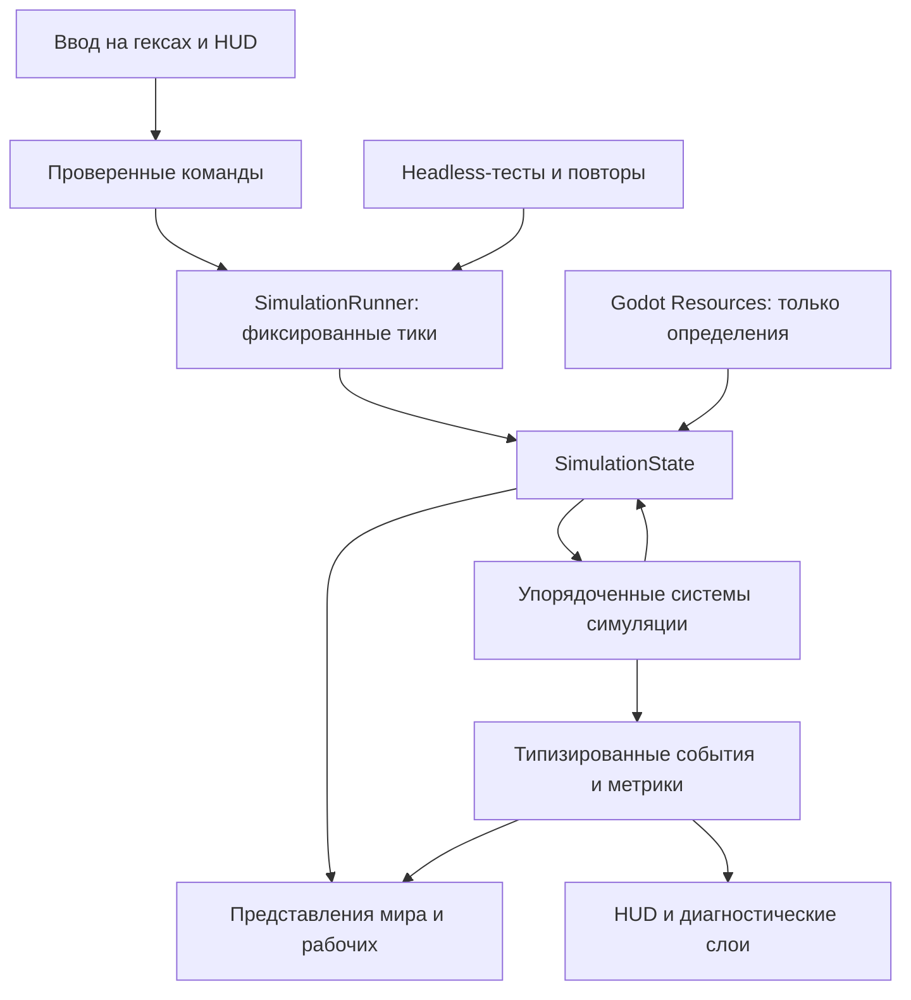

# Прототип стимпанк-логистики — проектная спецификация

**Статус:** согласовано для подготовки плана реализации

**Дата:** 2026-07-10

**Движок:** Godot 4.6.2, GDScript

**Рабочий репозиторий:** `https://github.com/igolebe7-lab/steampunk.git`

## 1. Замысел игры

В перспективе это колониально-индустриальный стимпанк-автоматизатор на гексах. Главная фантазия игрока — не просто построить завод, а провести общество через промышленный перелом. Люди, животные, дороги, транспорт, паровые машины и локальные конвейеры сосуществуют; новый уровень логистики не должен мгновенно делать предыдущий бесполезным.

Основные принципы, которые необходимо сохранить:

1. Физическая логистика: рабочие, а позднее транспорт, действительно перемещают видимые грузы.
2. Индустриальный переход: ручной труд постепенно становится механизированным.
3. Новая технология заменяет одно ограничение другим, а не устраняет игровой процесс.
4. В полной игре пар станет физической сетью давления, а не абстрактным электричеством.
5. Основное давление создаёт усложняющаяся система, а не обязательная война.

Полная концепция намеренно значительно шире первого цикла разработки. Первый прототип проверяет только самую рискованную и отличительную гипотезу.

## 2. Гипотеза и критерии успеха прототипа

**Гипотеза:** наблюдать, диагностировать и улучшать физический поток рабочих и грузов интересно ещё до появления продвинутой автоматизации.

Прототип представляет собой сценарий на 15–20 минут на подготовленной карте размером 18×18 гексов. Игрок начинает с неэффективной логистической сети и шести автономных носильщиков. Цель — доставить ресурсы, необходимые для запуска котла и первого удара парового молота.

Прототип считается успешным, если игрок:

- завершает сценарий примерно за 15–20 минут;
- самостоятельно находит первое узкое место;
- понимает диагностическое объяснение задержки;
- повышает пропускную способность хотя бы на 25% с помощью дорог, одного перевалочного склада или приоритетов;
- замечает явную разницу между открытой землёй, тропой и грунтовой дорогой;
- понимает, что паровой молот запущен благодаря реорганизации логистики.

## 3. Ход игровой сессии

### 0–3 минуты: наблюдение

Лагерь, главный склад, четыре источника ресурсов и шесть носильщиков уже существуют. Источники создают грузы с фиксированной скоростью. Носильщики самостоятельно принимают заказы на доставку и перемещаются по открытой земле. Игрок может изучать рабочих, задания, маршруты и запасы.

### 3–7 минут: первое узкое место

Доставка дерева и железа использует неэффективный общий проход. Очередь заказов растёт, рабочие ждут освобождения занятых гексов, среднее время доставки увеличивается. Интерфейс показывает симптомы, но не навязывает единственное решение.

### 7–11 минут: улучшение потока

Игрок может построить или улучшить дорогу, поставить один перевалочный склад и изменить приоритет доставки. Система показывает изменение числа грузов в минуту и соотношение времени в пути и ожидания.

### 11–16 минут: новая нагрузка

Активируется строительная площадка парового молота. Ей одновременно нужны дерево, железо, уголь и бочки воды. Новая нагрузка снова создаёт напряжение в сети.

### 16–20 минут: перестройка и завершение

Игрок выполняет второе улучшение. Когда все грузы доставлены, котёл запускается, а паровой молот делает первый удар. Итоговая панель сравнивает пропускную способность и задержки до и после изменений игрока.

Жёсткого проигрыша нет. Остановившуюся сеть всегда можно восстановить перестройкой, сменой приоритетов или размещением склада.

## 4. Объём прототипа

### Входит в прототип

- плоское двухмерное представление сверху;
- гексагональная сетка в аксиальных координатах;
- один подготовленный сценарий 18×18;
- шесть физических носильщиков;
- заказы на доставку, автоматическое назначение, поиск пути, резервирование гексов, погрузка и разгрузка;
- дерево, железо, уголь и вода;
- открытая земля, тропа и грунтовая дорога с разной стоимостью перемещения;
- лагерь, источники, главный склад, один перевалочный склад, котёл и паровой молот;
- действия «построить дорогу», «поставить склад», «изменить приоритет» и «осмотреть»;
- пауза и скорости симуляции ×1, ×2 и ×4;
- диагностические слои и инспектор рабочего;
- метрики сценария и итоговый экран;
- минимальные звуки строительства, погрузки, разгрузки, пара и удара молота.

### Упрощено

- источники создают груз без симуляции добытчиков;
- каждый носильщик переносит одну стандартную единицу груза;
- существует только одна профессия рабочего;
- пар представлен бинарным состоянием «снабжение есть / снабжения нет»;
- заторы используют детерминированное резервирование гексов вместо полной симуляции столкновений;
- груз на складе хранится как тип и количество, а не как отдельный объект мира;
- существует только один сценарий и одна цель.

### Явно не входит

- потребности, усталость, жильё, лояльность, здоровье и оплата рабочих;
- животные, повозки, тягачи, рельсы, конвейеры и автоматоны;
- физическое давление, трубы, утечки, перегрев и взрывы котлов;
- дерево технологий, исследования и несколько эпох;
- погода, катастрофы, боевые действия и враждебные существа;
- процедурная генерация карты;
- сохранение и загрузка, обучающая кампания и полноценные настройки доступности;
- финальная графика, музыка и производственный баланс.

## 5. Язык проекта и локализация

Русский язык является исходным языком проекта и игры.

На русском создаются:

- проектные спецификации и планы реализации;
- README, игровая документация и руководства;
- отчёты о тестировании и плейтестах, предназначенные для проверки владельцем проекта;
- весь пользовательский интерфейс, сообщения, цели, названия объектов и диагностические объяснения первой версии игры.

Технические идентификаторы GDScript, имена файлов и каталогов, имена классов и ключи локализации пишутся по-английски латиницей. Это сохраняет совместимость с Godot и инструментами разработки, не меняя язык пользовательской документации.

Весь пользовательский текст с первого этапа проходит через систему локализации Godot:

- строки не зашиваются напрямую в сцены и игровую логику;
- код обращается к семантическим ключам через `tr()` и `tr_n()`;
- диагностические коды преобразуются в ключи локализации;
- динамические значения передаются в переводимые шаблоны через именованные параметры;
- шрифты обязаны полностью поддерживать кириллицу;
- базовая локаль проекта — `ru`;
- каталог `localization/game.csv` содержит столбец ключей и русские значения; новые языки добавляются отдельными столбцами без изменения игрового кода;
- отсутствие перевода обнаруживается автоматической проверкой каталога.

В первом прототипе не требуется пользовательский экран выбора языка и не требуется готовый английский перевод. Архитектура обязана позволять подключить второй язык и переключить локаль через `TranslationServer` без изменения симуляции, UI-компоновки и ключей.

## 6. Архитектурное решение

Прототип использует **data-first архитектуру с детерминированной симуляцией на фиксированных тиках**, отделённой от узлов представления Godot. Симуляция является единственным источником игровой истины. Отображение читает снимки состояния и события, но не владеет запасами, заданиями, маршрутами, решениями рабочих или прогрессом сценария.



Стандартная частота симуляции — 10 тиков в секунду. Отображение стремится к 60 кадрам в секунду и интерполирует положение рабочих между завершёнными тиками. Частоту тиков можно менять для тестов, но игровая логика никогда не зависит напрямую от длительности кадра рендера.

Поток данных всегда однонаправленный:

`ввод → команда → тик симуляции → состояние и события → отображение`

## 7. Модель состояния

`SimulationState` — единственный изменяемый снимок мира. Он содержит:

- границы карты и данные гексов;
- рабочих и их текущее состояние;
- здания и локальные запасы;
- заказы на доставку и назначения;
- маршруты и резервирование гексов;
- игровое время, состояние сценария и метрики;
- детерминированный seed после появления случайности.

Основные сущности получают стабильные целочисленные идентификаторы. Связи между сущностями используют идентификаторы, а не пути к узлам Godot.

Ключевые типы модели:

- `HexCoord`: значение аксиальной координаты `q/r`;
- `HexCellState`: тип земли, уровень дороги, занятость и резервирование;
- `WorkerState`: положение, прогресс движения, груз, задание, маршрут и причина ожидания;
- `BuildingState`: идентификатор определения, положение, запасы, запросы и приоритет;
- `DeliveryJob`: источник, назначение, тип груза, состояние, приоритет и исполнитель;
- `ScenarioState`: текущая фаза, требования цели, завершение и измерения.

Godot `Resource` используется для неизменяемых авторских определений:

- `ResourceDef`: идентификатор, ключ отображаемого имени, цвет и значок;
- `RoadDef`: цена строительства, стоимость перемещения и свойства отображения;
- `BuildingDef`: занимаемые гексы, цена, правила запасов, запросы и сцена представления;
- `ScenarioDef`: карта, начальные сущности, ограничения, цель и интервалы измерения.

Изменяемые запасы и состояние мира никогда не хранятся в общих ресурсах-определениях.

## 8. Порядок систем симуляции

Каждый тик выполняет системы в стабильном порядке:

1. `CommandSystem` проверяет и применяет накопленные команды игрока.
2. `JobSystem` превращает потребности складов и доступные грузы в заказы.
3. `AssignmentSystem` назначает подходящие заказы свободным рабочим.
4. `PathSystem` создаёт или восстанавливает маршруты.
5. `MovementSystem` резервирует гексы и перемещает рабочих.
6. `InventorySystem` выполняет погрузку и разгрузку.
7. `ScenarioSystem` обновляет прогресс цели и состояние завершения.
8. `TelemetrySystem` измеряет пропускную способность, время пути, ожидание и узкие места.
9. `InvariantChecker` выполняется в debug- и тестовых сборках.

Системы не используют узлы сцен Godot для связи. Они получают состояние и явные зависимости, после чего возвращают события или значения результата. События публикуются после изменения состояния, поэтому отображение никогда не видит частично выполненный тик.

## 9. Границы интеграции с Godot

Сцены и узлы Godot являются адаптерами вокруг симуляции:

- `GameApp` — единственный начальный autoload, управляющий запуском сценария;
- `SimulationRunner` управляет тиками, паузой и скоростью времени;
- `WorldView` рисует карту и синхронизирует представления зданий;
- `WorkerView` интерполирует положение рабочего и показывает переносимый груз;
- `HUDController` превращает действия интерфейса в команды;
- `DiagnosticsView` показывает маршруты, загрузку, очереди и причины ожидания;
- `CameraController` управляет перемещением, масштабом и границами камеры.

Сигналы используются на границах представления для крупных событий: завершение сценария, смена выделения и готовность нового снимка. Глобальная шина событий в прототипе не используется. GDScript статически типизируется везде, где это позволяет Godot, а autoload применяется только для действительно глобального жизненного цикла приложения.

Godot `TranslationServer` используется напрямую для локали и перевода интерфейса. Отдельный глобальный менеджер локализации не вводится, пока не появится поведение, которого нет в стандартной системе движка.

## 10. Интерфейс

Карта остаётся главным пространством. Панели располагаются по краям и не закрывают логистическую сеть. Все подписи получают текст через ключи локализации.

### Верхняя панель

- текущее количество дерева, железа, угля и воды;
- прогресс цели «Паровой молот»;
- пауза и скорости ×1, ×2 и ×4.

### Левая панель диагностики

Переключаемые слои:

- маршруты рабочих;
- загрузка дорог и узкие места;
- запасы;
- очередь работ и неназначенный спрос.

### Правый инспектор

Для выбранного рабочего показываются:

- текущее задание и груз;
- источник и место назначения;
- длина пути и примерное время прибытия;
- время в движении и ожидании;
- понятная причина ожидания.

Для здания та же область показывает запасы, входящие запросы, приоритет и причины блокировки.

### Нижняя панель действий

Доступны только четыре действия:

- построить или улучшить дорогу;
- поставить единственный перевалочный склад;
- изменить приоритет;
- осмотреть.

Мини-карта, большой каталог строительства, экран технологий и многостраничное управление не входят в прототип.

## 11. Ошибки, восстановление и наблюдаемость

Команды игрока возвращают структурированные причины отказа: гекс вне карты, клетка занята, недостаточно ресурсов, недопустимая форма здания или отсутствует соединение с дорогой. Интерфейс переводит коды причин в локализованные короткие сообщения.

Каждый заказ имеет явное состояние и причину ожидания. Поддерживаются причины: нет рабочего, нет груза, склад назначения заполнен, маршрут отсутствует, гекс временно зарезервирован. Если маршрут стал недоступен, рабочий освобождает резервирование, возвращает заказ в очередь и запрашивает новый путь. Рабочие не должны молча застывать.

Debug- и тестовые сборки после тиков проверяют следующие инварианты:

- запас не может быть отрицательным;
- один заказ нельзя назначить нескольким рабочим;
- один гекс нельзя несовместимо зарезервировать нескольким рабочим;
- погрузка и разгрузка сохраняют общее количество груза;
- маршрут не выходит за границы карты;
- идентификаторы ссылаются на существующие сущности.

Симуляция хранит ограниченный журнал последних событий и начальный seed. Ошибочный сценарий можно воспроизвести в headless-режиме с тем же начальным состоянием и трассой команд.

Некорректные определения ресурсов, зданий, сценария или локализации приводят к явной ошибке загрузки. Игра не запускает частично корректный мир.

## 12. Пайплайн ассетов

### Функциональный graybox

Первая реализация использует масштабируемые векторные формы, плоские цвета, подписи и простые эффекты. Визуальный язык служит диагностике:

- дерево — зелёное;
- железо — серо-синее;
- уголь — почти чёрное;
- вода — голубая;
- нормальный поток — нейтральный;
- ожидание — янтарное;
- блокировка — красная.

Рабочие представлены кругами с направлением движения и значком груза. Дороги различаются шириной, яркостью и обработкой края. Здания имеют разные силуэты и короткие локализованные подписи. Все элементы остаются читаемыми при разных масштабах камеры.

### Первый художественный проход

Художественный проход начинается только после успешного механического плейтеста:

1. согласовать короткий визуальный style guide;
2. согласовать по одному эталону рабочего, склада, дороги и парового молота;
3. создать согласованные серии изображений;
4. нормализовать палитру, масштаб, тени и точки привязки;
5. заменить ассеты представления без изменения симуляции.

Визуальное направление — тёплый материальный стимпанк: латунь, чугун, дерево, кирпич, мокрая земля, ткань, дым и пар. Это не мрачный дизельпанк и не буквальное воспроизведение Земли XIX века.

Редактируемые исходники и готовые игровые ассеты хранятся раздельно. Сгенерированные Godot данные `.godot/`, локальные файлы brainstorming, журналы и экспортированные сборки не попадают в Git.

## 13. Стратегия тестирования

### Модульные тесты

Headless-тесты проверяют:

- соседей, расстояние, преобразования и стоимость пути на гексах;
- создание и назначение заказов;
- поиск и перестроение пути;
- резервирование и детерминированное разрешение конфликтов;
- погрузку, разгрузку и сохранение количества груза;
- проверку команд;
- одинаковый результат для одинакового ввода.

### Сценарные тесты

Маленькие фиксированные сценарии проверяют:

- доставку от источника до склада;
- восстановление после изменения маршрута;
- блокировку заполненным складом с правильной причиной;
- измеримое улучшение после строительства дороги;
- работу перевалочного склада;
- завершение после доставки всех грузов к паровому молоту.

### Интеграционные тесты Godot

Godot 4.6.2 в headless-режиме проверяет:

- импорт ресурсов;
- разбор GDScript без ошибок;
- запуск главной сцены;
- создание и удаление объектов представления;
- паузу и управление скоростью;
- сигнал завершения сценария;
- наличие русского значения для каждого используемого ключа локализации;
- переключение на тестовую вторую локаль без изменения кода;
- отсутствие обрезания ключевых русских подписей в HUD на целевом разрешении.

### Плейтест и визуальная проверка

Сценарий полностью проходится в редакторе Godot. Скриншоты проверяют читаемость русского HUD и поведение диагностических слоёв. Метрики и наблюдения сравниваются с критериями раздела 2.

### Стресс-тест

Неигровой сценарий 40×40 с 50 рабочими запускается на частоте 10 тиков в секунду. Он обнаруживает архитектурные проблемы, которые не проявятся на шести рабочих. Первичное требование — симуляция не должна постоянно снижать частоту отображения или накапливать отставание тиков на рабочем Mac. Числовой бюджет будет установлен по первому профилю, а не выдуман заранее.

## 14. Структура проекта

```text
project.godot
src/
  simulation/
    model/
    commands/
    systems/
    events/
  presentation/
    world/
    diagnostics/
  ui/
  app/
data/
  resources/
  buildings/
  roads/
  scenarios/
localization/
  game.csv
scenes/
assets/
  source/
  game/
tests/
  unit/
  scenarios/
  integration/
```

Файлы остаются небольшими и разделяются по ответственности. Типы модели симуляции не импортируют типы представления. Представление может читать публичные снимки состояния и типизированные события, но не может напрямую менять состояние симуляции.

## 15. Этапы реализации

### Этап 1: основа проекта

- метаданные Godot и правила игнорирования файлов;
- headless-раннер тестов;
- типизированная координата гекса и модель карты;
- отображение гексов сверху, камера и выбор клетки;
- каталог локализации с русской базовой локалью и проверка кириллического шрифта.

**Условие перехода:** тесты координат проходят, карта 18×18 запускается в Godot, а тестовая локализованная подпись отображается на русском без жёстко зашитого текста.

### Этап 2: мир с фиксированными тиками

- `SimulationState`;
- очередь команд и раннер тиков;
- определения ресурсов и зданий;
- детерминированная загрузка подготовленного сценария.

**Условие перехода:** одинаковые трассы команд создают одинаковые хэши состояния.

### Этап 3: физическая логистика

- заказы на доставку и назначение;
- поиск пути и резервирование гексов;
- движение рабочих и интерполяция;
- погрузка и разгрузка.

**Условие перехода:** шесть автономных рабочих многократно доставляют груз без потерь, дублирования и молчаливых зависаний.

### Этап 4: управление и диагностика

- дороги, один перевалочный склад и приоритеты;
- слои маршрутов и загрузки;
- инспектор рабочего и здания;
- метрики пропускной способности и задержек;
- полный русский набор строк для доступного интерфейса.

**Условие перехода:** тестовое улучшение дороги даёт подтверждённый рост пропускной способности, а интерфейс по-русски объясняет активные узкие места.

### Этап 5: полный сценарий

- четыре ресурса;
- котёл и цель с паровым молотом;
- переходы фаз и итоговый экран;
- минимальные звуки и эффекты.

**Условие перехода:** сценарий полностью проходится за 15–20 минут, а все пользовательские строки берутся из каталога локализации.

### Этап 6: проверка и первый художественный проход

- полный набор headless-тестов и стресс-тест;
- плейтест в редакторе и визуальная проверка;
- согласованные эталоны стиля;
- целостный набор ассетов прототипа.

**Условие перехода:** критерии успеха измерены и задокументированы на русском до расширения объёма игры.

## 16. Правило расширения

Животные, транспорт, физическая сеть пара, дерево исследований, процедурный мир, социальная симуляция и боевые действия не добавляются, пока прототип не подтвердит, что диагностика и улучшение логистики рабочих интересны сами по себе. Если гипотеза не подтверждается, изменяется взаимодействие с логистикой, а не добавляется контент. Если гипотеза подтверждается, следующий проектный цикл выбирает ровно одно направление расширения и получает отдельную русскоязычную спецификацию и план реализации.
